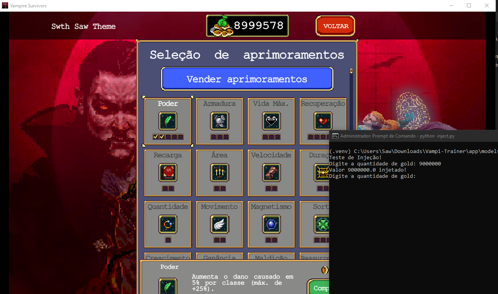

# Vampi-Trainer

## Visão Geral

**Vampi-Trainer** é um projeto em desenvolvimento focado em **injeção de código** para aplicações específicas. 
Esta ferramenta tem como objetivo facilitar a modificação de parâmetros internos de softwares utilizando "pointers" 
e manipulação de memória em tempo de execução.

> **Nota:** Este projeto encontra-se em fase **alpha** e está sendo testado ativamente. 
Funcionalidades estão sujeitas a alterações e o código pode conter bugs.

---

## Estrutura do Projeto

- **`app/`**: Contém os módulos principais do projeto, incluindo:
  - **`main.py`**: Arquivo principal para execução.
  - **`models/`**: Inclui o código relacionado às injeções (ex.: `inject.py`) e configurações (`settings.json`).
  - **`pointers/`**: Contém os arquivos de ponteiros específicos (ex.: `pointer-gold.PTR`).
- **`.venv/`**: Ambiente virtual Python contendo dependências do projeto.

---

## Configuração

### Requisitos
- Python 3.12 ou superior
- Sistema operacional Windows ou compatível com manipulação de memória

### Instalação
1. Clone este repositório:
   ```bash
   git clone <URL_DO_REPOSITORIO>
   ```
2. Navegue até a pasta do projeto e ative o ambiente virtual:
   ```bash
   cd Vampi-Trainer
   .venv\Scripts\activate
   ```
3. Instale as dependências:
   ```bash
   pip install -r requirements.txt
   ```

### Execução
Execute o arquivo principal para iniciar a aplicação:
```bash
python app/main.py
```

---

## Imagem de Exemplo

Insira aqui uma imagem mostrando o resultado da injeção de código:



---

## Status

- **Fase:** Alpha
- **Estado:** Em desenvolvimento ativo

Se você encontrar bugs ou tiver sugestões, por favor, abra uma _issue_ ou entre em contato.

---

## Licença
Este projeto está licenciado sob a [MIT License](LICENSE).
